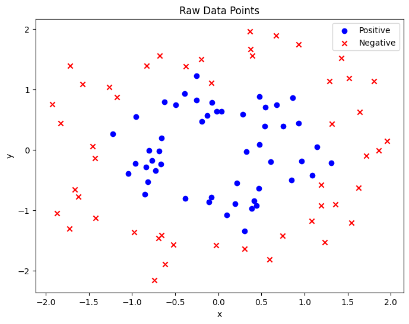
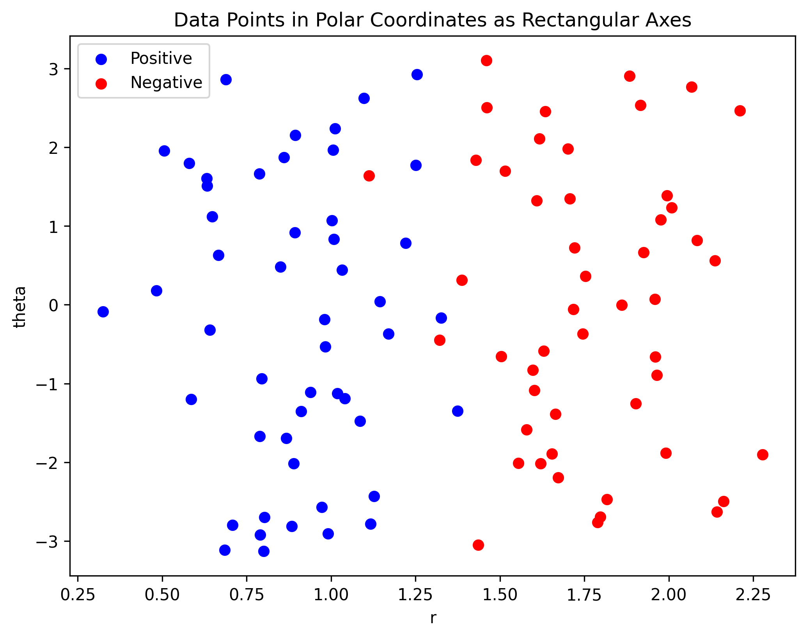

# When Do Linear Models Work? Feature Representation vs Model Complexity in Non-Linear Classification

Most introductory machine learning material states that linear models (e.g., logistic regression) fail on non-linear decision boundaries, motivating the use of more complex methods such as kernelized models.

## Motivation

The common claim that “linear models cannot solve non-linear problems” is true in the original feature space. In practice, model performance is often governed less by how the data is represented as much as the choice of algorithm.

This project explores the following hypothesis:

> With appropriate feature transformations, simple linear models can recover complex decision boundaries that would otherwise require more sophisticated methods.

---

## Approach

To investigate this, we compare three modeling strategies on a non-linearly separable dataset:

- **Kernel-based method**  
  Support Vector Machine with RBF kernel as a flexible, high-capacity baseline.

- **Feature-engineered linear model**  
  Logistic regression applied to transformed features derived from geometric insight (polar coordinates and angular structure).

- **Custom parametric boundary**  
  A conic-section-inspired decision boundary, optimized directly via numerical methods.

---

## Key Idea

Instead of increasing model complexity, we modify the **representation of the data**:

- Transform Cartesian coordinates → polar coordinates  
- Introduce structured features (e.g., radial and angular components)  
- Encode symmetry and geometry explicitly  

This allows a linear model to operate in a space where the problem becomes separable.

---

## What This Project Shows

- Model limitations can be bypassed by a suitable representation of the system
- Feature engineering can rival more complex models in expressive power
- Incorporating domain or structural insight can significantly reduce model complexity
- There is a trade-off between model flexibility and feature design effort

---

## Extensions

To further test these ideas, the project includes experiments on synthetically generated datasets with controlled noise and known decision boundaries. This allows evaluation of:

- Robustness to noise  
- Stability of different modeling approaches  
- When feature engineering breaks down relative to more flexible models  

---

## Repository Structure

- `data/` — input datasets (real and synthetic)  
- `notebooks/` — exploratory analysis and visualizations  
- `src/` — model implementations and utilities  
- `results/` — plots and comparison outputs  

---

## Summary

Rather than asking *“Which model should I use?”*, this project reframes the question as:

> *“How should the problem be represented so that simple models succeed?”*

This perspective is central to effective machine learning in real-world systems.

---

## Results & Key Findings

- Feature-engineered logistic regression achieved comparable performance to SVM on non-linear data
- Proper feature representation can reduce the need for complex models
- Custom parametric boundaries provide interpretability but require careful design
- Under increasing noise, kernel methods degrade more gracefully than engineered features

---
n
## Conclusion

Model performance is not solely determined by algorithmic complexity, but by how well the data representation aligns with the underlying structure of the problem.

This suggests that, in many practical settings, investing in feature design can be as impactful as selecting more complex models.
