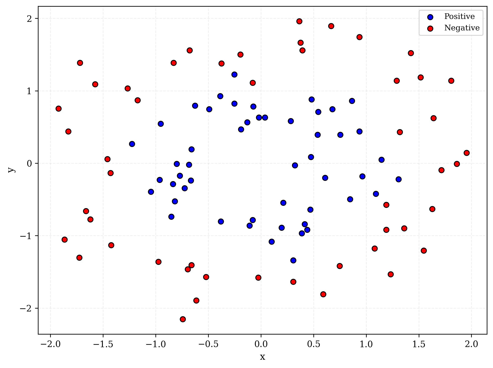
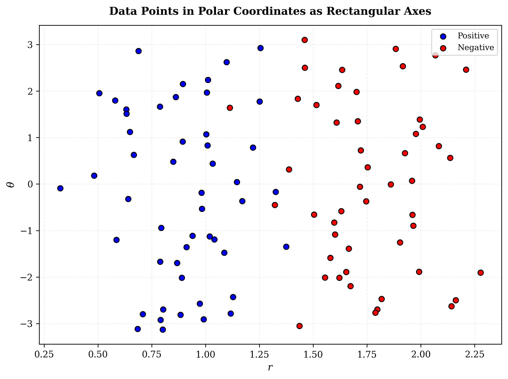
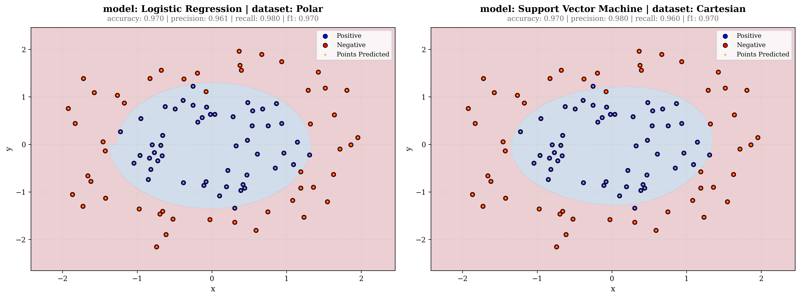
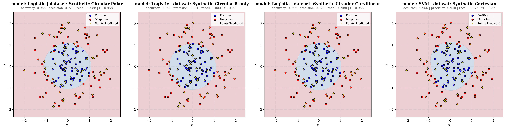
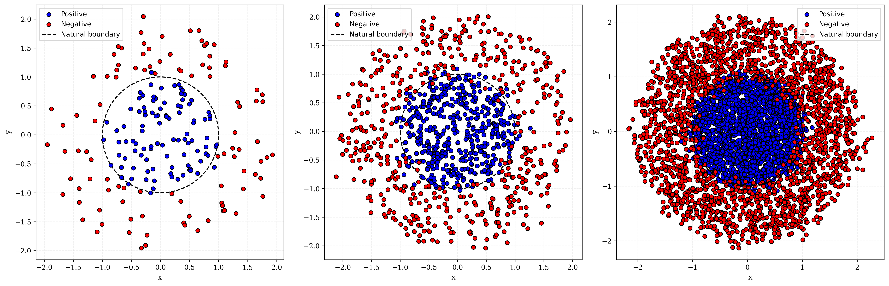
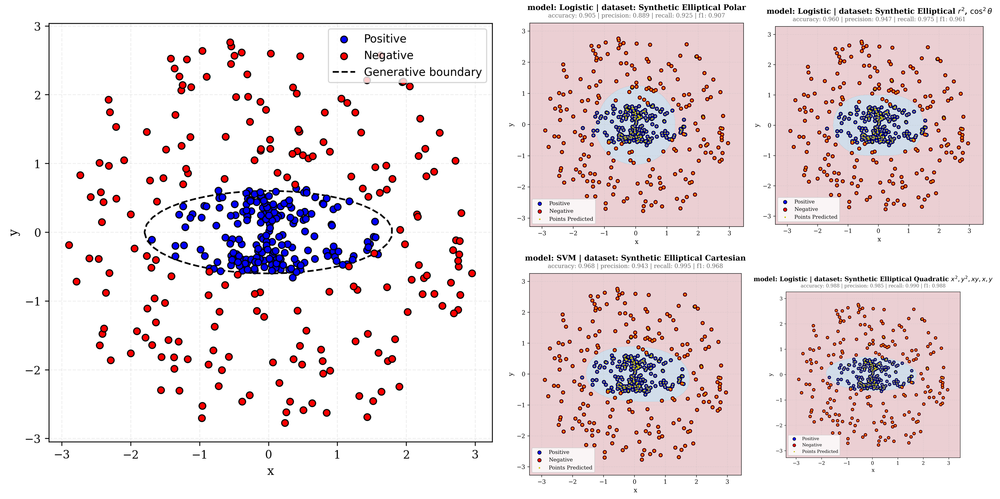
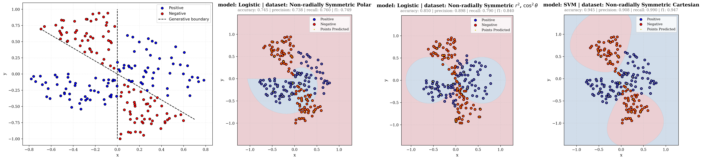

# Learning Decision Boundaries: Representation, Inductive Bias, and Model Complexity

This project originated from a simple question raised by a common example in machine learning: a 2D dataset presented as non-linearly separable. By inspecting the geometry, I hypothesized that the apparent non-linearity was due to the choice of representation rather than the intrinsic structure of the data. Under an alternative representation, the same data might become linearly separable.

This led to a series of experiments comparing model complexity against feature representation, exploring whether simple models could match more complex ones when given appropriate features.

## Motivation

In many machine learning problems, performance is often attributed to model complexity. Non-linear datasets are typically handled  by increasing model capacity with flexible models such as kernel methods or neural networks. This introduces a trade-off:

- Higher capacity → better fit but reduced interpretability
- Lower capacity → stronger assumptions but improved structure clarity

This project investigates whether part of this trade-off can be shifted:

Can appropriate feature representations reduce the need for model complexity?

---

## Approach

We study a non-linearly separable classification problem and compare three strategies:

### 1. Flexible Model (Baseline)
- Support Vector Machine with RBF kernel.
- High-capacity model that learns non-linear boundaries directly in input space.

### 2. Feature-Engineered Linear Models
- Logistic regression applied to transformed features.
- Structured features capturing geometry (radius and angular dependence components).
    - Polar coordinates ($r, \theta$).
    - Features designed to capture elliptical geometric structure while maintaining a linear decision function in the transformed feature space ($r^2, \cos{\theta}^2$).

#### Feature Engineering for Elliptical Boundaries

For axis-aligned ellpses parametrized by

$$
\begin{gather*}
x(t) = a\cos{t}\\
y(t) = b\sin{t}
\end{gather*}
$$

the squared distance from the origin is

$$
r^2(t) = a^2\cos^2{t} + b^2\sin^2{t}
$$

which can be rewritten as

$$
r^2(t) = b^2 + (a^2-b^2)\cos^2{t}
$$

The parameter angle $t$ is related to the polar angle $\theta$ through

$$
\tan{\theta} = (b/a) \tan{t}
$$

allowing $θ$-based approximations that become exact in the circular limit.

Defining:

$$
g_{i}(t) = b^2 + (a^2-b^2)\cos^2{t} - R_{i}^2
$$

gives
- $g(t) \geq 0$ for points $(R_{i}, t_{i})$ inside the ellipse $r(t)$
- $g(t)$ on the boundary
- $g(t) < 0$ outside the ellipse

Introducing the approximation $\theta \approx t$, allows to evaluate $g(\theta) \approx g(t)$ and thus

$$
g_{i}(\theta) = b^2 + (a^2-b^2)\cos^2{\theta} - R_{i}^2
$$

This transformation yields a linear decision boundary in the augmented feature space. Consequently, the argument passed to the sigmoid function becomes a linear combination of $R_{i}^2$ and $\cos^2{\theta}$, enabling the direct application of standard linear logistic regression. Learned parameters in this model are more readily interpretable.

A more general alternative suitable for conic section boundaries or boundaries that could be approximated by them.

A representation based on the general quadratic equation for conic sections is introduced

$$
Ax^2 + By^2 + Cxy + Dx + Ey = 0
$$

Using the function on the left as the sigmoid function argument allows for flexibility to approximately conic section decision boundaries. While less immediately interpretable, these learned parameters can be effectively mapped into well-known characterizations of circles, ellipses, parabolas and hyperbolas.

---

## Key Idea

Instead of increasing model complexity, we modify the representation of the data:

- Encode geometric structure explicitly.
- Transform to coordinate systems aligned with the problem.
- Reduce the burden on the learning algorithm.

This shifts complexity from the model to the representation.

A heavy linear dependence on radial distance is made explicit by this visual.

---

## Results

### Statistical Evaluation

Cross-validation results on the original dataset analyzed using the Friedman test did not reveal statistically significant differences in F1-score across models under the evaluated conditions ($p > 0.05$). This suggests that feature-engineered linear models can achieve performance comparable to higher-capacity kernel methods when the representation aligns with the underlying geometric structure of the data.

For the original dataset, all models were evaluated using identical stratified 5-fold cross-validation splits.

A Friedman test was applied to fold-level F1 scores to compare models while accounting for paired observations across folds.

The test did not reject the null hypothesis of equal model performance:

- Friedman statistic: 3.41
- p-value: 0.332

Under the evaluated conditions, no statistically significant differences were detected between the compared models.

This supports the interpretation that appropriately engineered representations allow simple linear models to achieve performance comparable to more flexible nonlinear methods on this dataset.

Feature-engineered logistic regression achieves performance comparable to kernel-based methods when:

- The transformation aligns with the underlying geometry (mutual information score is increased by these features)
- Inductive bias matches data structure
- Latent distribution implemented by features is more robust to noise (as will be seen later)

However:

- Misaligned representations degrade performance more sharply than flexible models

This reveals a structural asymmetry:

> Representation improves efficiency, but reduces robustness to misspecification.

While these results suggest a strong role of representation, further quantitative validation is needed to distinguish structural improvements from sampling effects.

---

### Synthetically Generated Datasets

The project includes experiments on synthetically generated datasets with controlled noise and known decision boundaries. This allows evaluation of:

- Robustness to noise
- Stability of different modeling approaches
- When feature engineering breaks down relative to more flexible models

In a controlled synthetic setting with known geometric structure, model performance differences are consistent with dependence on the interaction between sample size and representation alignment. In low-data regimes, inductive bias and feature engineering strongly influence performance. As sample size increases, all sufficiently expressive models converge to near-optimcal decision boundary, and differences reduce to computational efficiency rather than predictive accuracy, with simpler models taking less time to train on larger datasets.

#### Circular Boundaries Scale Evaluation

Cross validation was performed on synthetically generated datasets of different sizes. For small scale datasets (100 points per class), five folds were used while 10 folds were used for medium (500 points per class) and large (2000 points per class) datasets.

| Model / Data Repr. | Fit Time | Accuracy | Precision | Recall | F1 |
| :--- | :--- | :--- | :--- | :--- | :--- |
| **SMALL-SCALE** | | | | |
| Log. Regr. / Polar | 0.00180 +/- 0.00109 | 0.970 +/- 0.010 | 0.952 +/- 0.001 | 0.990 +/- 0.020 | 0.970 +/- 0.010 |
| Log. Regr. / R-only | 0.00084 +/- 0.00012 | 0.980 +/- 0.010 | 0.962 +/- 0.019 | 1.000 +/- 0.000 | 0.980 +/- 0.010 |
| Log. Regr. / Curvilinear | 0.00078 +/- 0.00003 | 0.975 +/- 0.016 | 0.961 +/- 0.019 | 0.990 +/- 0.020 | 0.975 +/- 0.016 |
| SVM / Cartesian | 0.00059 +/- 0.00004 | 0.965 +/- 0.034 | 0.951 +/- 0.032 | 0.980 +/- 0.040 | 0.965 +/- 0.034 |
| **MEDIUM-SCALE** | | | | | |
| Log. Regr. / Polar | 0.00170 +/- 0.00085 | 0.949 +/- 0.017 | 0.933 +/- 0.028 | 0.967 +/- 0.013 | 0.950 +/- 0.016 |
| Log. Regr. / R-only | 0.00103 +/- 0.00012 | 0.946 +/- 0.018 | 0.932 +/- 0.028 | 0.964 +/- 0.013 | 0.948 +/- 0.017 |
| Log. Regr. / Curvilinear | 0.00109 +/- 0.00007 | 0.945 +/- 0.019 | 0.933 +/- 0.029 | 0.960 +/- 0.014 | 0.946 +/- 0.017 |
| SVM / Cartesian | 0.00309 +/- 0.00016 | 0.946 +/- 0.017 | 0.932 +/- 0.027 | 0.964 +/- 0.018 | 0.948 +/- 0.016 |
| **LARGE-SCALE** | | | | | |
| Log. Regr. / Polar | 0.00304 +/- 0.00144 | 0.957 +/- 0.004 | 0.948 +/- 0.004 | 0.968 +/- 0.008 | 0.958 +/- 0.004 |
| Log. Regr. / R-only | 0.00194 +/- 0.00011 | 0.957 +/- 0.004 | 0.947 +/- 0.005 | 0.968 +/- 0.009 | 0.957 +/- 0.004 |
| Log. Regr. / Curvilinear | 0.00230 +/- 0.00006 | 0.957 +/- 0.004 | 0.947 +/- 0.005 | 0.968 +/- 0.008 | 0.957 +/- 0.004 |
| SVM / Cartesian | 0.05543 +/- 0.00122 | 0.957 +/- 0.002 | 0.946 +/- 0.004 | 0.970 +/- 0.006 | 0.958 +/- 0.002 |

Performance across data sizes is similar, but logistic models outperform in computational efficiency up to around 25 times compared to SVM.

#### Elliptical Boundaries

A synthetic dataset with elliptical distribution for one of the classes was produced, with some noise that caused points to cross the generation classification boundary.

Unlike the circular-boundary experiments, the elliptical-boundary experiments no longer favor purely radial features because distance from the origin alone is insufficient to uniquely characterize class membership.

The curvilinear representation remains more flexible because its features contain a natural approximation to elliptical equations, surpassing the polar representation decisively. SVM on the Cartesian representation proves to be even more flexible to capture the elliptic relation. The curvilinear representation substantially narrows the gap relative to the polar representation, demonstrating that geometry-informed features recover much of the performance obtained by more flexible nonlinear models.

| Model / Data Repr. | Accuracy | Precision | Recall | F1 |
| :--- | :--- | :--- | :--- | :--- |
| **Log. Regr. / Polar** | 0.908 | 0.898 | 0.920 | 0.909 |
| **Log. Regr. / Curvilinear** | 0.955 | 0.942 | 0.970 | 0.956 |
| **SVM / Cartesian** | 0.968 | 0.943 | 0.995 | 0.968 |
| **Log. Regr. / Quadratic Cartesian** | 0.980 | 0.970 | 0.990 | 0.980 |

Among the evaluated models, logistic regression using quadratic Cartesian features achieved the best performance on this dataset. Because elliptical boundaries are members of the conic family, the engineered feature space provides a natural representation of the underlying geometry, allowing a linear classifier to recover a highly effective decision boundary.

#### Non-Radially Symmetric Boundaries

Simple models are observed to not generalize well against distribution of data not reflected by the selected features. A sample of non-radially symmetric dataset without noise was generated.

Simpler models fail to classify the data with reasonable performance with the selected features, and the observed decision boundaries provide visual evidence of this behavior. SVM performs significantly better, even if not ideal, using the Cartesian representation of the data. Tradeoffs for SVM are noted when the polar representation is used.

The quadratic Cartesian representation performs particularly well because the synthetic elliptical boundary belongs to the family of conic sections. By engineering features corresponding to the general quadratic form, the true decision boundary is contained within the induced hypothesis space. This illustrates a central theme of the project: when domain knowledge allows the feature space to closely match the data-generating process, simple linear models can achieve performance comparable to—or even exceeding—that of more flexible nonlinear methods. Since crossing straight lines can be approximated by hyperbolas, logistic regression taking advantage of the general conic quadratic equation features performs solidly to separate the classes.

| Model / Data Repr. | Accuracy | Precision | Recall | F1 |
| :--- | :--- | :--- | :--- | :--- |
| **Log. Regr. / Polar** | 0.680 | 0.691 | 0.650 | 0.670 |
| **Log. Regr. / Curvilinear** | 0.775 | 0.789 | 0.750 | 0.769 |
| **SVM / Cartesian** | 0.930 | 0.922 | 0.940 | 0.931 |
| **SVM / Polar** | 0.935 | 1.000 | 0.870 | 0.930 |
| **Log. Regr. / Quadratic Cartesian** | 1.000 | 1.000 | 1.000 | 1.000 |

### Computational Efficiency

As dataset size increases, predictive performance across sufficiently expressive models converges, while computational differences become more pronounced.

On the largest synthetic datasets, engineered logistic regression models achieved predictive performance comparable to SVMs while requiring approximately one order of magnitude less training time.

This illustrates that representation engineering can improve not only predictive performance, but also computational efficiency.

---

## Insights

### Representation vs Model Complexity

- Model performance is not only determined by algorithm choice, but by how the data is represented.
- Simple models can recover complex behavior when structure is encoded explicitly.

### Inductive Bias Matters

- Feature engineering introduces assumptions about symmetry and geometry.
- When the encoded structure matches the underlying distribution, model performance is more robust against noise.
- These assumptions can significantly improve efficiency—but also introduce failure modes.

### Trade-offs

- Flexible models: robust, but less interpretable and prone to overfitting.
- Engineered representations: efficient and interpretable, but require pre-conceived domain insight.

### Inductive Bias Distribution

Different approaches distribute inductive bias differently:

- SVM: bias in kernel choice
- Logistic regression: bias in feature space

This provides a unified interpretation:

> Learning systems differ primarily in where they encode assumptions.

---

## Failure Modes

The experiments also highlight structural failure cases:

- Representation mismatch leads to brittle performance
- Parametric models fail under boundary misspecification
- Flexible models degrade gracefully but remain opaque

This introduces a practical trade-off:

Interpretability and efficiency increase with structured representations, but robustness increases with flexibility.

---

## Repository Structure

- `data/` — input datasets (real)
- `notebooks/` — exploratory analysis
- `src/` — model implementations and synthetic data generation
- `results/` — visualizations and comparisons

---

## Summary

> This project demonstrates that learning performance depends not only on model complexity but also on how structure is represented in the feature space.

Across both real and synthetic datasets, geometry-informed feature engineering frequently enabled simple linear models to approach the performance of more flexible nonlinear methods. When the representation aligned with the data-generating process, predictive performance, interpretability, and computational efficiency could all be improved simultaneously.

On large synthetic datasets, engineered logistic regression achieved performance comparable to SVM while reducing training time by approximately 25×.

These experiments highlight a central machine learning principle: model capacity and feature representation are complementary sources of inductive bias, and effective learning often depends as much on choosing the right representation as on choosing the right algorithm.

When domain knowledge can be translated into an appropriate feature space, simple interpretable models can approach the performance of substantially more flexible nonlinear methods while retaining advantages in transparency and computational efficiency.